# Lab - Agent Studio Use Case: AI Customer Retention (Telecom)

In this lab, you will explore Cloudera Agent Studio to deploy an AI-driven Customer Retention application for a Telecom use case. 

**Use Case Scenario:** AI Customer Retention delivers hyper-personalized telecom experiences using AI Agents that analyze customer profiles and usage behavior, predict churn risk, review competitor offers, and recommend the right plans, add-ons, or loyalty benefits — all in real-time on Cloudera AI.

**Objective:** Stay ahead in a competitive telecom market by leveraging AI agents that continuously monitor customer activity and market dynamics — transforming customer experience and driving proactive retention strategies.

**Business Impact:**
* **Enhanced Customer Loyalty & Engagement:** AI-powered personalization increases satisfaction and reduces churn by offering timely upgrades, rewards, and retention incentives tailored to each user.
* **Boosted Revenue via Upsell & Cross-sell:** Real-time usage insights empower agents to recommend data boosters, family plans, roaming packs, and OTT bundles — maximizing revenue per user.
* **Competitive Edge through Market Intelligence:** Continuous analysis of competitor promotions enables SmartTel to respond instantly with attractive offers and localized pricing advantages.
* **Operational Efficiency & Regulatory Alignment:** Automated, auditable decision-making minimizes manual workloads, enhances campaign ROI, and ensures alignment with data privacy and regional telecom regulations.

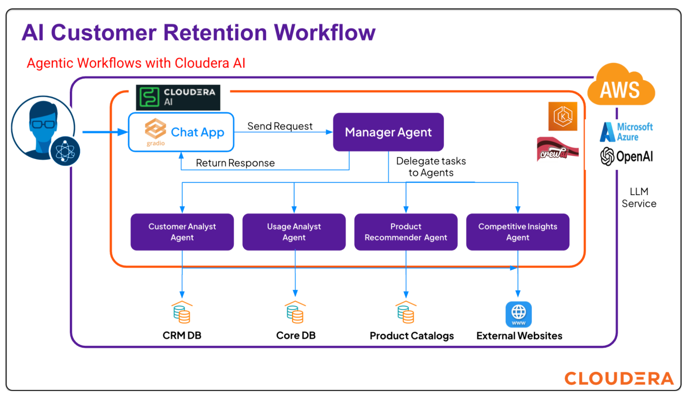

## Requirements

Ensure the following requirements and credentials are met in order to run this exercise (these will be shared by the Trainers):
- [ ] Workload User and Password from User Profile
- [ ] Virtual Warehouse Name from CDW Impala (`hive_cai_data_connection_name`)
- [ ] Database Name from CDW Impala (`default_database`)

---

## Tasks

### Step 1: Log in to Cloudera Platform & AI Workbench

1. Login using the credentials provided by your trainer.
2. Update **Workload Password** > **Management Console** > **User Profile**.
3. Click on **Cloudera AI** > Select the **Cloudera-AI-Workshop** workbench.
   
   

4. Go to **Projects** on the left side panel > Select **Public Projects** from the dropdown.
5. Click on the publicly available project named **HOL_Agent_Studio**.
   
   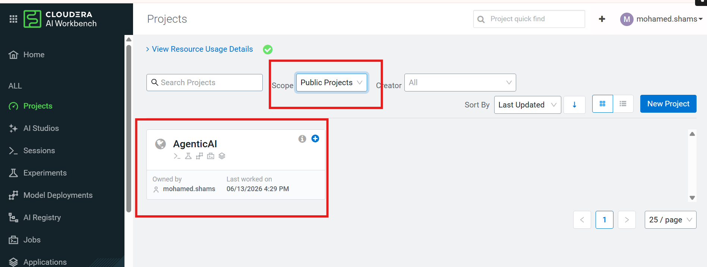

6. Click on **AI Studios** > **Agent Studio**.
   
   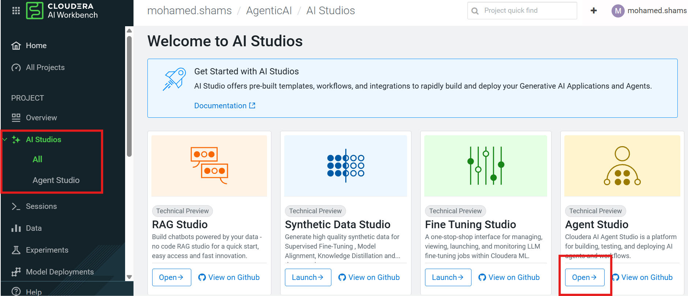

### Step 2: Understand the Agent Studio Environment

Take a moment to understand the main components of the Agent Studio interface:
1. **Agentic Workflows:** Dashboard with End-to-End Agentic Workflows & Use Cases Development and Deployment.
2. **Tools Catalog:** Build custom Python tools to enhance your AI agents capabilities and supercharge your workflows.
3. **LLMs:** Hybrid Muti LLM Model Registry to Register language models which will be used to build agents and workflows.
4. **Deployed Workflows:** Single Pane of Glass to All Production Workflow and Use Cases.
5. **Draft Workflows:** Management and Collaboration all the Development Workflows.
6. **Workflow Templates:** Workflows Catalog to share and re-use the workflows.
7. **Create:** Build your Agentic Workflow from scratch.

   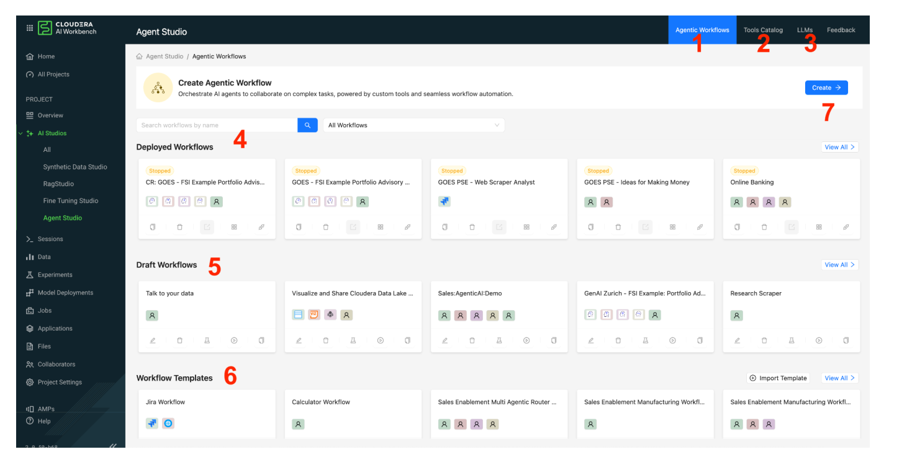

### Step 3: [OPTIONAL] Create the WorkFlow Template for Telco 

*(Note: This step is optional based on the lab type. If the trainer has already created the Workflow Template, you can ignore this step. OR you can follow this step to deploy a new workflow from scratch - Confirm with your Trainer.)*

1. Click **Create** > **AI Customer Retention Workflow**.
2. Configure the following toggles:
   * **Is Conversational:** ON
   * **Manager Agent:** ON
   * **Default Manager**

   

3. Create the following 4 Agents:
   * **Customer Analyst**
     * **Role:** Customer Segmentation and Profiling Specialist.
     * **Backstory:** Skilled in profiling and segmentation using customer data for personalized telecom strategies.
     * **Goal:** Build customer personas using demographics, location, tenure, and ARPU to inform personalization strategies from `customer_profiles` table.
     * **Tool:** CRM Database
   * **Usage Analyst**
     * **Role:** Interprets usage data including voice, SMS, data consumption, and recharge behavior.
     * **Backstory:** Specializes in behavioral analytics to support targeting for marketing and engagement.
     * **Goal:** Detect customer usage patterns like data, voice, sms, recharge, prepaid churn risks, or upsell-ready profiles using the data from `usage_history`.
     * **Tool:** Core DataBase
   * **Product Recommender**
     * **Role:** Maintains detailed knowledge of telecom plans, loyalty programs, and ongoing offers.
     * **Backstory:** Product expert helping align offerings with usage trends and customer potential.
     * **Goal:** Match customers with the most relevant offers based on their profile and usage from `offer_catalog`.
     * **Tool:** Product Catalog
   * **Competitive Insights**
     * **Role:** External Market Intelligence Agent.
     * **Backstory:** Competitive intelligence agent scraping the latest Telecom promotions. Website shared by the user.
     * **Goal:** Scrape website content given by the user for prepaid, postpaid, voice, data, sms offers and compare with internal product catalog, and propose competitive positioning.
     * **Tool:** Competitive Offerings

   

4. Configure the Connection Parameters (Confirm with the Trainers):
   * `workload_user`: Workload user from User Profile.
   * `workload_pass`: Workload password from User Profile.
   * `hive_cai_data_connection_name`: Virtual Warehouse Name from CDW Impala.
   * `default_database`: Database Name from CDW Impala.
5. Click **Save & Next**.

   

### Step 4: Building the Use Case Workflow

1. Click **Create** > Select the Workflow from the **AI Customer Retention Template**.
2. Name the use case: **Userxxx - AI Customer Retention** (replace `Userxxx` with your assigned user).
   
   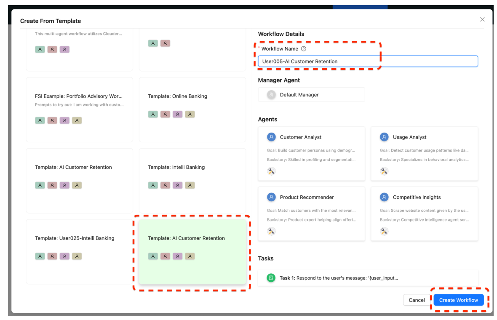

3. **Understand the Workflow and Agents:**
   * Click **Edit Agents** to understand the functionality of each agent and the flow (Name, Role, Backstory, Goal).
   * ⚠️ **Don’t Make Any Changes but Just Close.**
   * Click **Save & Next** until you arrive at the **Configure** page.
   
   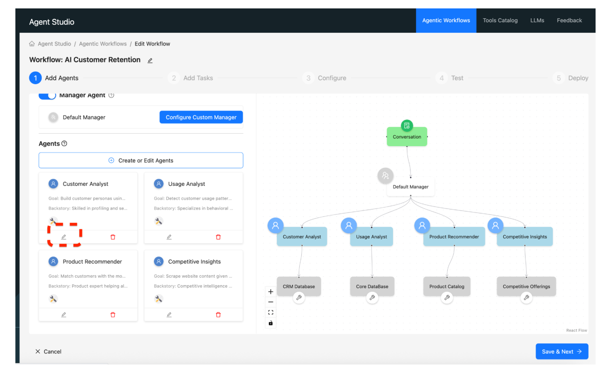

4. **Configure the requested parameters:**
   * Confirm with the Trainers for credentials.
   * `workload_user`: Workload user from User Profile.
   * `workload_pass`: Workload password from User Profile.
   * `hive_cai_data_connection_name`: Virtual Warehouse Name from CDW Impala.
   * `default_database`: Database Name from CDW Impala.
   * Click **Save & Next**.
   
   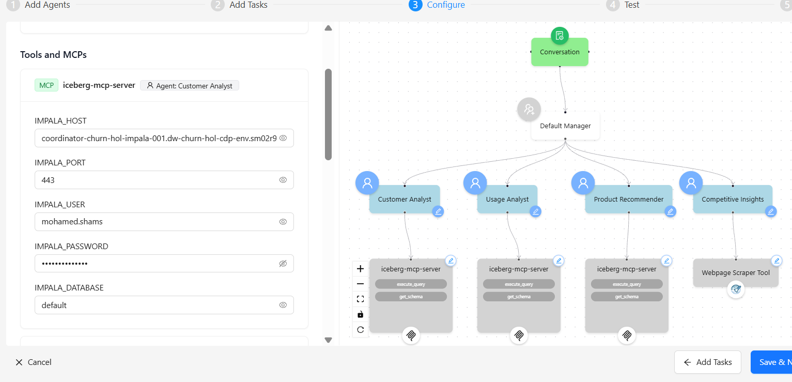

*(FYI Only) Overview of the Data Base, Tables and Actual Data:*
* **CRM Database:** It has `customer_profiles` table with the below data fields: `CustomerID, Name, Gender, Age, City, Country, PlanType, TenureMonths, ARPU`.
* **Core Database:** It has `usage_history` table with the below data fields: `CustomerID, UsageDate, DataUsed_GB, VoiceMinutes, SMSCount, RechargeAmount`.
* **Product Catalog:** It has `offer_catalog` table with the below data fields: `OfferID, OfferType, OfferName, Description, Eligibility, Discount, Validity`.
* **Competitive Offerings:** It is a web scraper that fetches data from any given competitor website.

### Step 5: Test the Workflow with Sample Queries

Test the workflow with the following queries:
* *Who are our most active customers this month?*
* *Which customers haven’t recharged in the last 30 days?*
* *What’s the most popular offer among prepaid users?*

   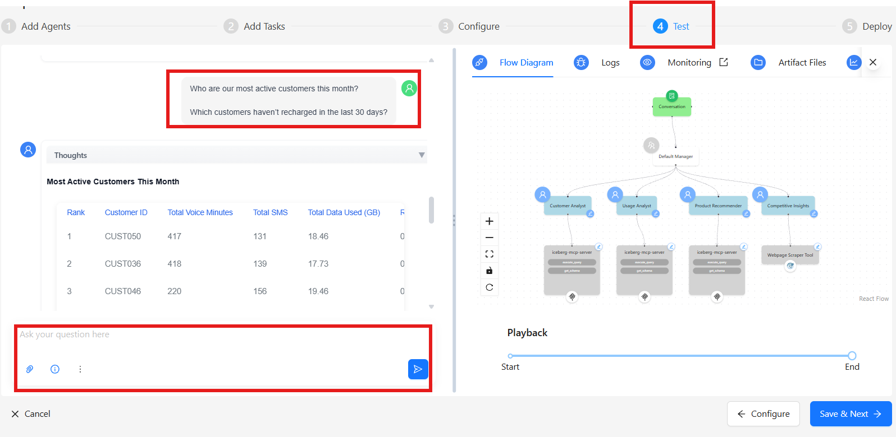

### Step 6: Deploy the Workflow

1. Click **Save & Next** > **Deploy**. 
2. Deployment will take approximately 5 - 7 minutes to complete.

   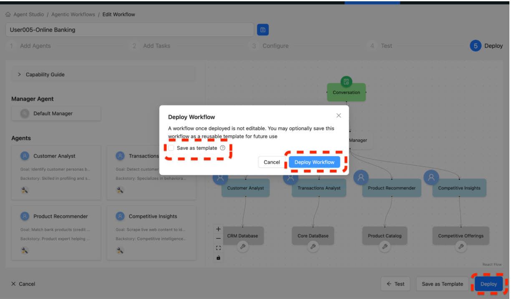

### Step 7: Accessing Product Workflow

1. Go to the Home Page of Agent Studios.
2. Select your Workflow from **Deployed Workflows**.
3. Click on **Open Application UI**.

   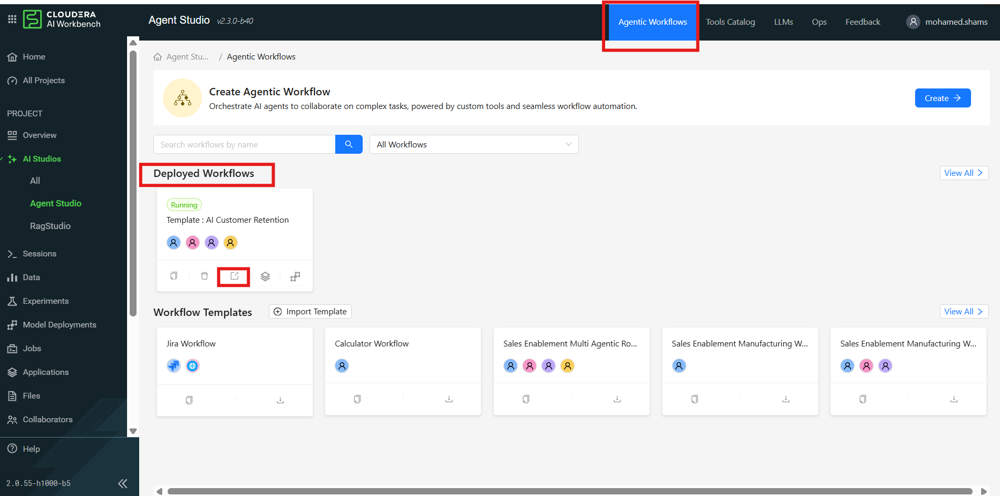

### Step 8: Play with your Live Application!

Test out your new Agentic AI application using sample business questions:
* *Which customers are most likely to upgrade their plan in the next 30 days?*
* *Which customers are eligible for loyalty rewards this month based on consistent usage and ARPU?*
* *What are the plans offers by [competitor telecom] \<website> ?*
* *How competitive are our roaming or data booster offers compared to [competitor telecom] \<website> ?*

   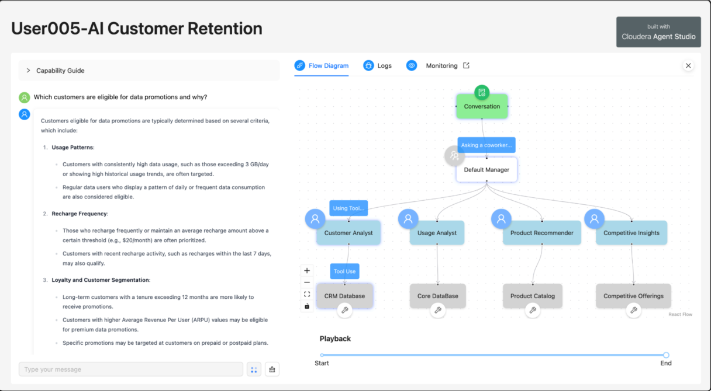

**End of Lab**
